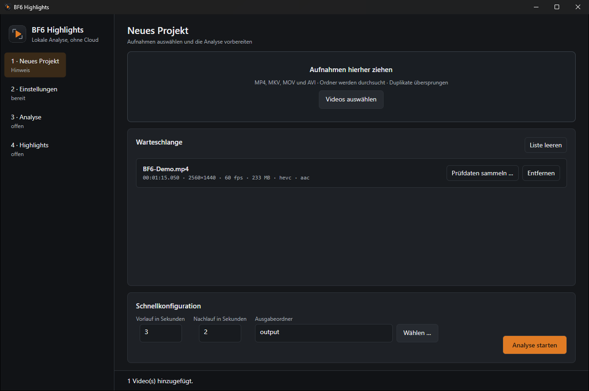
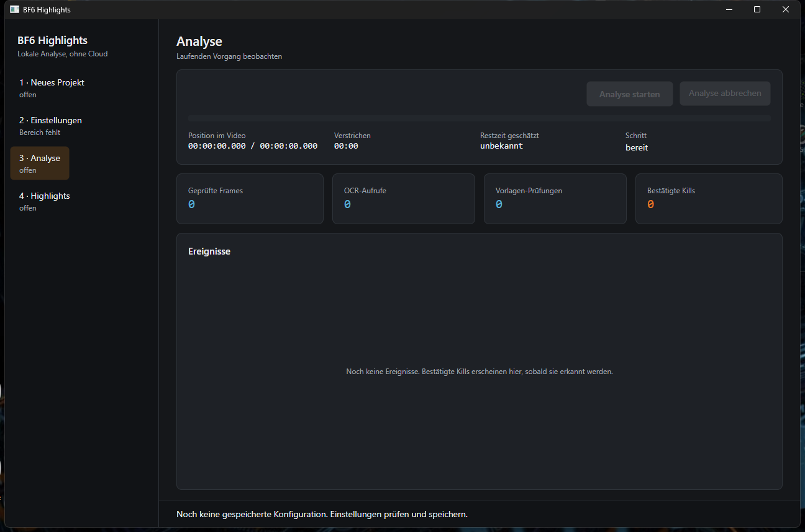
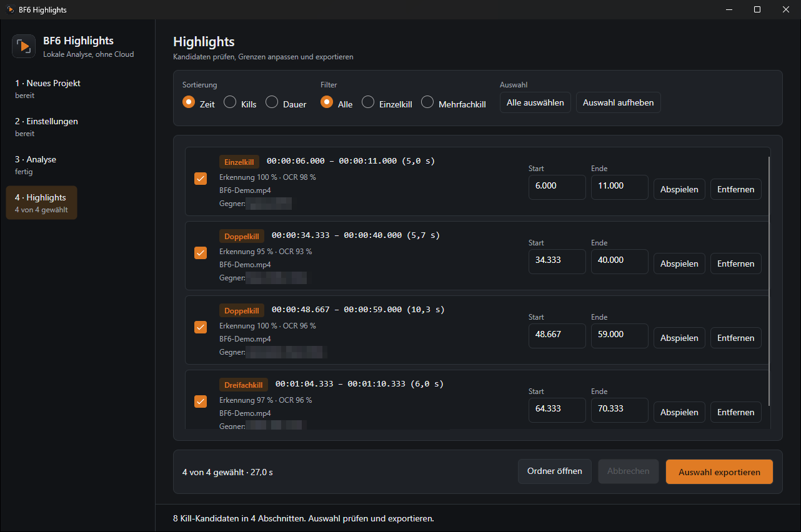
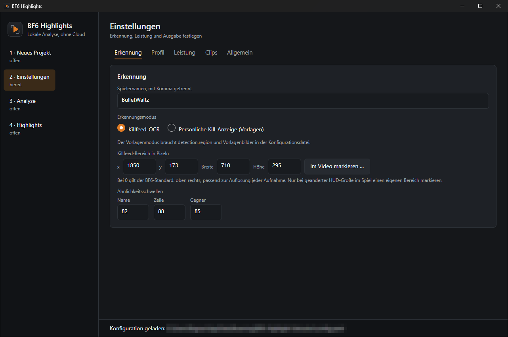

# BF6 Highlight Extractor

Findet in langen Battlefield-6-Aufnahmen die eigenen Kills und schneidet daraus Clips.
Die Anwendung läuft vollständig auf dem eigenen Rechner: keine Cloud-Erkennung, kein
Konto, kein Upload, keine Telemetrie. Windows 11, 64 Bit.



## Wie es funktioniert

Eine zweistündige Aufnahme Bild für Bild durch eine Texterkennung zu schicken wäre
unbezahlbar. Die Anwendung geht deshalb in zwei Stufen vor:

1. **Abtasten und vergleichen.** Aus dem Video wird nur eine feste Zahl Bilder pro Sekunde
   geholt, standardmäßig drei, und davon nur der Ausschnitt mit dem Killfeed. Ändert sich
   dieser Ausschnitt gegenüber dem zuletzt geprüften nicht, passiert nichts weiter. Das ist
   billig und spart den größten Teil der Arbeit.
2. **Erkennen, wenn sich etwas geändert hat.** Erst dann läuft die Texterkennung über den
   Ausschnitt.

Entscheidend ist danach die **Seite**, auf der der eigene Name steht. `EigenerName ⟶ Waffe
⟶ Gegner` ist ein eigener Kill. `Gegner ⟶ Waffe ⟶ EigenerName` ist der eigene Tod und wird
verworfen. Den Namen irgendwo im Killfeed zu finden genügt ausdrücklich nicht.


Weil eine Killfeed-Zeile mehrere Sekunden stehen bleibt, wird derselbe Kill dutzendfach
erkannt, oft mit anders gelesenem Namen (`darkrabbit`, `derkrabbit`). Innerhalb eines
Zeitfensters gilt ein Treffer deshalb als derselbe Kill, wenn der Gegner einer bereits
gelesenen Schreibweise ähnelt oder gar nicht lesbar war; denselben Gegner kann man in
diesen Sekunden nicht zweimal töten. Verschiedene Gegner bleiben getrennte Kills.

Pings und Markierungen (`… hat eine Gefahr gepingt`, `Ping abgebrochen`) stehen im selben
Killfeed und tragen den eigenen Namen. Sie werden als Satz erkannt und verworfen.

Aus den Zeitpunkten entstehen Clip-Abschnitte, standardmäßig drei Sekunden davor und zwei
danach. Liegen Abschnitte dicht beieinander, werden sie zu einem Mehrfachkill-Clip
zusammengefasst.

Die Texterkennung ist unscharf, weil sie muss: `l`, `I`, `1` und `|` sehen im Spiel gleich
aus, ebenso `0` und `O`. Namen werden normalisiert und über Ähnlichkeitswerte verglichen,
nicht über exakte Gleichheit.

Alternativ gibt es einen **Vorlagenmodus**, der statt des Killfeeds die persönliche
Kill-Bestätigung unter dem Fadenkreuz per Bildvergleich sucht.

## Installieren

Unter [Releases](https://github.com/Diddlik/BF6-Highlight-Extractor/releases) die neueste
Version laden:

- `BF6HighlightExtractor-win-Setup.exe` installiert die Anwendung in das Benutzerprofil.
  Adminrechte sind nicht nötig.
- `BF6HighlightExtractor-win-Portable.zip` lässt sich einfach entpacken und starten.

Das Paket bringt alles mit: .NET-Laufzeit, Erkennungsmodelle, FFmpeg. Es muss nichts
zusätzlich installiert werden. Das Paket ist nicht signiert, deshalb meldet Windows beim
ersten Start SmartScreen; über „Weitere Informationen“ lässt es sich trotzdem starten.

## In fünf Schritten zum ersten Clip

1. **Aufnahmen hinzufügen.** Dateien in die Fläche ziehen oder auswählen. MP4, MKV, MOV und
   AVI; ganze Ordner werden durchsucht. Jede Aufnahme zeigt Dauer, Auflösung, Bildrate,
   Größe und Tonspur, unlesbare Dateien nennen den Grund.
2. **Spielernamen eintragen.** Unter *Einstellungen* genau so, wie er im Killfeed steht.
   Mehrere Schreibweisen mit Komma trennen.
3. **Killfeed-Bereich prüfen.** Ohne eigene Angabe gilt der BF6-Standard: oben rechts,
   passend zur Auflösung jeder Aufnahme, auch bei Ultrawide. Nur wer die HUD-Größe im Spiel
   verändert hat, markiert mit *Im Video markieren …* ein eigenes Rechteck über dem Killfeed.
4. **Analyse starten.** Der Fortschritt zeigt Position im Video, verstrichene und
   geschätzte Restzeit, geprüfte Bilder, Erkennungsaufrufe und jeden bestätigten Kill,
   sobald er gefunden wird.
5. **Prüfen und exportieren.** Die Kandidaten lassen sich sortieren, filtern, abspielen, in
   den Grenzen verschieben und einzeln abwählen. **Auswahl exportieren** schreibt nur die
   gewählten Clips.





Die Analyse selbst schreibt nie Videodateien, sondern nur Berichte. Clips entstehen erst
beim Export. Vorhandene Clips werden nie überschrieben, Quellvideos nie verändert.

Für Trainings- und Prüfdaten besitzt jede importierte Aufnahme außerdem einen
Keyboard-Player: Mit Pfeiltasten navigieren, mit `Bild↓` zum nächsten erkannten Kill und
mit `Bild↑` zum nächsten eigenen Tod springen, Ereignisse per Kürzel markieren, rechts prüfen
und anschließend gesammelt exportieren. Details stehen unter
[Sample-Player: Bedienung und Weiterentwicklung](src/SAMPLE_PLAYER.md).

## Was dabei herauskommt

Je Aufnahme entsteht ein Ordner im gewählten Ausgabeziel:

| Datei | Inhalt |
| --- | --- |
| `events.json`, `events.csv` | jedes erkannte Ereignis mit Zeit, Gegner, Rohtext, Konfidenz und Ähnlichkeitswert |
| `segments.json` | die daraus gebildeten Clip-Abschnitte |
| `summary.json` | Laufzeit, geprüfte Bilder, Erkennungsaufrufe, gefundene Kills |
| `clips/` | die exportierten Clips, mit Ton |

Ein Abbruch mit Strg+C oder über die Schaltfläche behält alles bereits Gefundene und
hinterlässt keine halbfertigen Dateien.

## Einstellungen



Die Einstellungen sind in Tabs gegliedert: **Erkennung** (Spielernamen, Erkennungsmodus,
Killfeed-Bereich, Ähnlichkeitsschwellen), **Profil** (persönliches Erkennungsprofil),
**Leistung** (Abtastrate, parallele Erkennung), **Clips** (Vor- und Nachlauf,
Zusammenführungsabstand, Schnittart, Ausgabeordner) und **Allgemein** (Konfigurationsdatei,
Aktualisierung). Die Werte landen in einer
YAML-Datei unter `%APPDATA%\BF6-Highlight-Extractor\config.yaml`.

Zwei Werte lohnen die Aufmerksamkeit:

- **Bilder pro Sekunde** bestimmt, wie fein gesucht wird. Drei bis fünf sind üblich.
- **Parallele OCR** beschleunigt die Analyse, kostet aber Speicher: jede gleichzeitige
  Erkennung hält eine eigene Modellsitzung von gut 100 MB.

Eine vorhandene Konfiguration der alten Python-Fassung lässt sich übernehmen; dabei wird
gemeldet, was sich ändert, etwa ein nicht mehr unterstütztes Erkennungs-Backend.

## Aktualisierung

Die installierte Fassung sucht beim Start nach neuen Releases dieses Repositorys. Die Suche
lässt sich abschalten, und **Update prüfen** sucht sofort. Wird etwas gefunden, erscheint
über jeder Seite ein Hinweis; **Aktualisieren und neu starten** lädt die neue Fassung und
startet sie, **Später** blendet den Hinweis bis zum nächsten Start aus. Aus einem Build-Ordner
heraus gestartet aktualisiert sich nichts.

## Kommandozeile

Dieselben Abläufe ohne Fenster, etwa für Stapelverarbeitung:

```powershell
bf6-highlights.exe config-import config.example.yaml config.yaml
bf6-highlights.exe analyze "D:\Aufnahmen\match.mkv" config.yaml "D:\Highlights" --export
```

| Befehl | Zweck |
| --- | --- |
| `analyze VIDEO KONFIG ZIEL [--export]` | Analyse mit Berichten, auf Wunsch mit Clips |
| `export VIDEO EVENTS.json KONFIG ZIEL` | Clips aus einer vorhandenen `events.json` |
| `inspect-frame VIDEO KONFIG ZEIT` | Erkennung auf einem Einzelbild nachvollziehen |
| `next-kill VIDEO KONFIG ZEIT` | nächsten erkannten Kill ab einer Position suchen |
| `next-death VIDEO KONFIG ZEIT` | nächsten eigenen Tod suchen, für Negativbeispiele |
| `configure-region VIDEO KONFIG` | Killfeed-Bereich mit der Maus festlegen |
| `config-check KONFIG` | Konfiguration prüfen, Fehler je Feld |
| `sample VIDEO START ENDE ZEIT LABEL ZIEL` | beschriftete Prüfdaten sammeln |
| `train-profile ORDNER KONFIG` | Erkennung auf eigene geprüfte Samples kalibrieren |
| `profiles`, `profile-activate`, `profile-off` | Profile auflisten, aktivieren, abschalten |

Ohne Argumente zeigt die Anwendung die vollständige Liste.

## Selbst bauen

Nötig sind das .NET-10-SDK sowie FFmpeg und ffprobe auf dem PATH.

```powershell
cd src
dotnet build -m:1
dotnet test -m:1                # 234 Tests
dotnet run --project BFHE.UI    # Oberfläche starten
```

Die Tests brauchen kein Spielmaterial: Videos werden im Test mit FFmpeg erzeugt und die
Texterkennung durch eine Attrappe ersetzt.

Ein Release bauen und veröffentlichen:

```powershell
dotnet tool install -g vpk
.\src\release.ps1 -Version 0.3.0
.\src\release.ps1 -Version 0.3.0 -Publish -Token $env:GITHUB_TOKEN
```

Dasselbe läuft in GitHub Actions, ausgelöst durch einen Tag `v*` oder von Hand.

| Projekt | Inhalt |
| --- | --- |
| `src/Core` | Konfiguration, Bildstrom, Änderungserkennung, Texterkennung, Erkennung, Clips, Berichte |
| `src/Cli` | Kommandozeile |
| `src/BFHE.UI` | Oberfläche mit Avalonia |
| `src/Tests` | Tests samt eingefrorenen Referenzdaten |

## Stand und Grenzen

Die Anwendung ist die Portierung einer früheren Python-Fassung. Deren Entscheidungen sind
über eingefrorene Referenzdaten abgesichert: Normalisierung, Ähnlichkeitsvergleich,
Killer-Seite, Zusammenfassung, Clip-Grenzen und die Berichtsformate werden Feld für Feld
gegen die Originalausgabe geprüft.

Ehrlich benannt gehört dazu:

- **Die Erkennungsgüte ist nicht abgenommen.** Auf drei Aufnahmen mit 104 von Hand
  markierten Kills findet die Erkennung 87 von 88 Kill-Zeitpunkten und meldet 163 statt
  früher 282 Kandidaten. Ein Teil davon sind echte, nicht markierte Kills, ein Teil noch
  doppelte Lesungen stark verstümmelter Namen.
- **Gemessen ist bisher nur ein kurzer Ausschnitt.** Dort war die C#-Fassung rund 17-mal
  schneller als die Python-Fassung und brauchte ein Siebtel des Speichers. Ein Langlauf über
  Stunden steht aus.
- **Keine Codesignatur**, daher die SmartScreen-Meldung.
- Bewertung von Szenen, Zeitleiste und ein eigener Exportdialog fehlen noch.

## Lizenzen

Die Anwendung nutzt PP-OCRv5-Modelle über RapidOcrNet (Apache 2.0), OpenCV, ONNX Runtime,
LibVLC für die Vorschau (LGPL-2.1-or-later) und FFmpeg. Die Lizenztexte liegen im Paket
unter `licenses/`, die Herkunft steht in `PACKAGE-NOTICE.md` und
`THIRD-PARTY-NOTICES.md`. Welche FFmpeg-Buildoptionen mitgeliefert werden, entscheidet
über die Bedingungen einer Weitergabe; auch das steht dort.

Keine Battlefield-, EA- oder REDSEC-Marken, Logos oder Spielgrafiken gehören zu diesem
Projekt.
